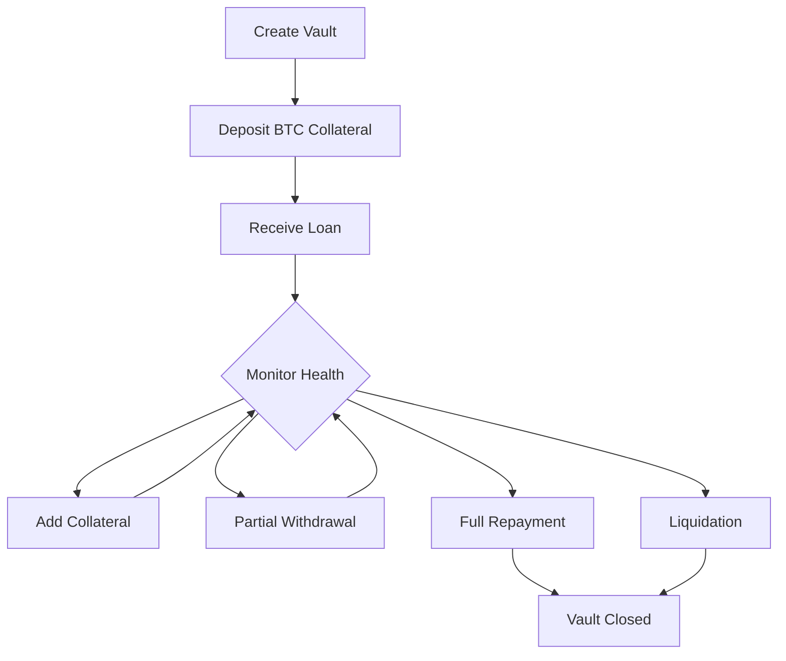

# 🌟 NeonVault

> *Next-Generation Bitcoin-Backed Lending Protocol*

[](https://opensource.org/licenses/MIT)
[](https://clarity-lang.org/)
[](https://stacks.co/)

NeonVault is a cutting-edge decentralized lending platform that enables users to unlock liquidity from their Bitcoin holdings without selling. Built on the Stacks blockchain using Clarity smart contracts, NeonVault offers a secure, transparent, and efficient way to collateralize Bitcoin for instant loans.

## ✨ Key Features

- **🔒 Bitcoin Collateralized Loans**: Use your Bitcoin as collateral without giving up ownership
- **⚡ Instant Liquidity**: Get funds immediately without lengthy approval processes  
- **🎯 Flexible Terms**: Customize loan duration and interest rates
- **📊 Real-time Health Monitoring**: Track your vault's collateralization ratio
- **🛡️ Automated Risk Management**: Built-in liquidation protection and safety mechanisms
- **🔧 Admin Controls**: Emergency pause functionality for protocol security

## 🏗️ Architecture

### Core Components

- **Vault System**: Individual loan containers that hold collateral and track borrowing
- **Health Factor Monitoring**: Real-time calculation of collateralization ratios
- **Payment Tracking**: Complete history of all loan settlements
- **Risk Management**: Automated liquidation triggers and collateral requirements

### Smart Contract Functions

#### Vault Management
- `open-vault` - Create a new Bitcoin-backed loan
- `boost-collateral` - Add more Bitcoin collateral to existing vault
- `reduce-collateral` - Withdraw excess collateral (maintaining minimum ratios)
- `settle-vault` - Repay loan and close vault

#### Risk & Liquidation
- `trigger-liquidation` - Execute liquidation of undercollateralized vaults
- `emergency-pause-vault` - Admin function to pause vaults in emergencies

#### Analytics
- `get-vault-info` - Retrieve detailed vault information
- `get-vault-health` - Check vault health metrics
- `get-protocol-stats` - View platform-wide statistics

## 🔧 Protocol Parameters

| Parameter | Value | Description |
|-----------|-------|-------------|
| **Minimum Collateral Ratio** | 150% | Required overcollateralization |
| **Liquidation Threshold** | 120% | Health factor triggering liquidation |
| **Maximum APR** | 100% | Interest rate ceiling |
| **Maximum Loan Duration** | ~1 year | Maximum vault term length |
| **Protocol Fee** | 1% | Fee collected on loan settlements |

## 🚀 Getting Started

### Prerequisites

- Stacks wallet (Leather, Xverse, or Hiro)
- Bitcoin for collateral
- STX tokens for transaction fees

### Deployment

1. **Clone the repository**
   ```bash
   git clone https://github.com/chisompeculiar/neonvault.git
   cd neonvault
   ```

2. **Install Clarinet** (Stacks development tool)
   ```bash
   curl -L https://github.com/hirosystems/clarinet/releases/latest/download/clarinet-linux-x64.tar.gz | tar xz
   ```

3. **Test the contract**
   ```bash
   clarinet test
   ```

4. **Deploy to testnet**
   ```bash
   clarinet deploy --network testnet
   ```

### Usage Example

```clarity
;; Open a new vault with 1 BTC collateral for 0.5 BTC loan
(contract-call? .neonvault open-vault 
  u100000000    ;; 1 BTC collateral (sats)
  u50000000     ;; 0.5 BTC loan amount (sats)  
  u500          ;; 5% APR
  u8760)        ;; ~2 months duration
```

## 📊 Vault Lifecycle



## 🔐 Security Features

- **Overflow Protection**: All arithmetic operations checked for overflow
- **Access Control**: Strict ownership validation for all operations
- **Parameter Validation**: Comprehensive input sanitization
- **Emergency Controls**: Admin pause functionality for critical situations
- **Immutable Logic**: Smart contract rules cannot be changed post-deployment

## 🧪 Testing

Run the comprehensive test suite:

```bash
clarinet test
```

Test coverage includes:
- Vault creation and management
- Collateral operations
- Liquidation scenarios  
- Edge cases and error conditions
- Access control validation

## 🤝 Contributing

We welcome contributions! Please see our [Contributing Guide](CONTRIBUTING.md) for details on:
- Code style and standards
- Testing requirements
- Pull request process
- Issue reporting


## ⚠️ Disclaimer

NeonVault is experimental software. Users should understand the risks associated with DeFi protocols including smart contract bugs, market volatility, and potential loss of funds. Always do your own research and never invest more than you can afford to lose.

---

*Built with ❤️ by the NeonVault team*